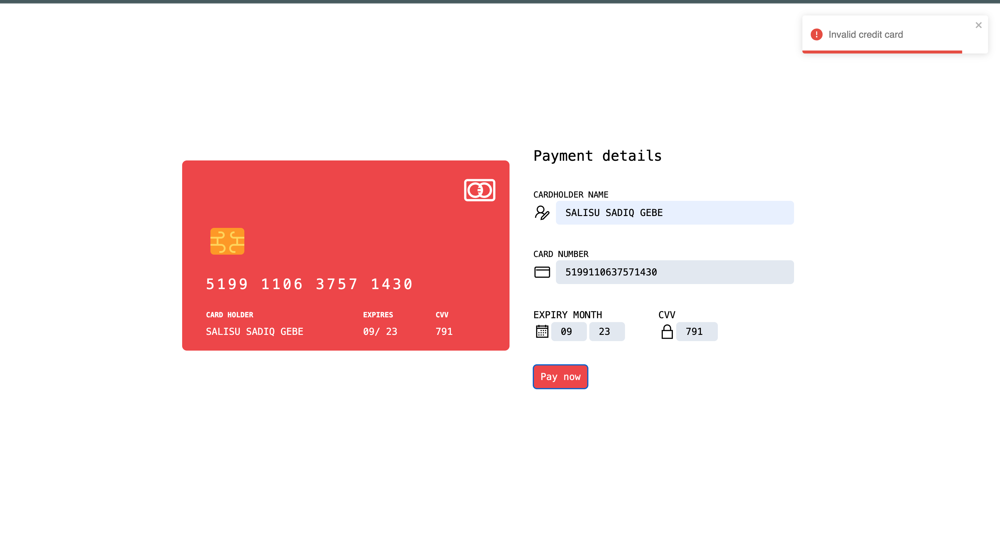

# Credit Card Validation App

This web application validates credit card details, including card numbers, expiry dates, and CVV.

## Backend and Frontend Setup

Both the backend and frontend are part of this project and are located in the same directory.

### Install Dependencies and start servers

1. Open a terminal and navigate to the project directory:
```bash
cd card-validation
```

2. Install backend dependencies using npm:
```bash
cd backend
npm install
```
3. To start the backend server:

```bash
npm start
```

The backend server will run on http://localhost:5000.

4. Open new terminal to  Install frontend dependencies using npm:

```bash
cd card-validation
npm install
```

5. To start the frontend server:
```bash
npm start
```

The development server will run on http://localhost:3000.

Accessing the Application
Once both the backend and frontend servers are running, you can access the application by navigating to http://localhost:3000 in your web browser.

### Credit card validation algorithm
The Credit validation algorithm Uses the renown Luhn algorithm the particular implentation can be found [here](./backend/utils/validateCard.js). under the validateCardNumber function.


### Valid credit card validation image


### Invalid credit card validation image

